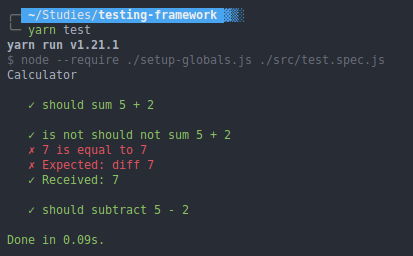

# Testing Framework

This repository was made on a studies group with the purpose of create a testing framework similar to *Jest*.

### Already done

- [x] test;
- [x] describe;
- [x] expect;
- [x] toBe;

### Todo

- [ ] not;
- [ ] toBeTruthy
- [ ] toBeFalsy
- [ ] beforeEach
- [ ] afterEach
- [ ] mock
- [ ] spy
- [ ] toHaveBeenCalled

### Running
